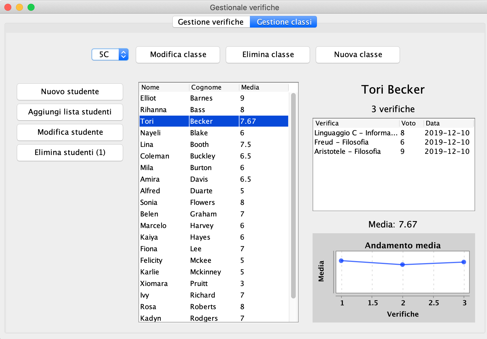
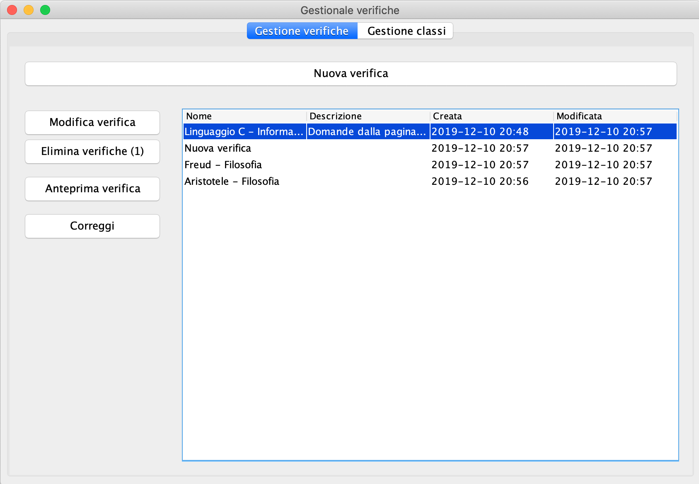
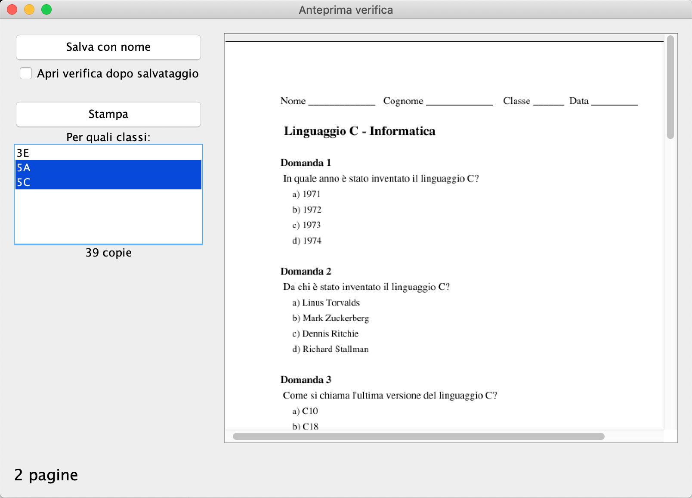

# Gestionale verifiche

This project was developed by nicob97 and me for a University exam.

## Features
* Manage your school classes and students
* Create and print tests for your students
* Correct tests and visualize stats about results
* And more...

## Screenshots
### Manage school classes and students

### Manage your tests

### Preview your tests before printing

## Download
You can download the JAR [here](https://github.com/riggraz/gestionale-verifiche/releases/tag/1.0).
